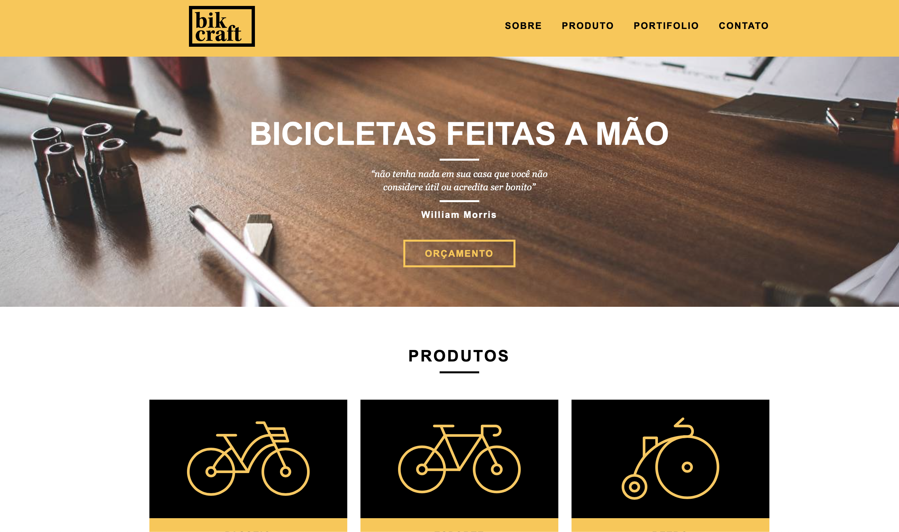

# Project Make for Sale Bike
> This I build for sales and have in my portifolio, show how i can working.


Here a simple image about this project



## Installation

OS X ,Linux & Windons:

```sh
  git clone https://github.com/digomes87/bike.git
```


## Usage example

Like any back end programmer, my layouts have never been very beautiful, I have decided to change that, and since then I look for references, courses, and apply a little of that every day. Here is one of the results I liked the most.


## Development setup
  Here in just a html css and javascript, you can use this, but for apply in a CMS you will need a web designer or developer for apply.


## About Me

Diego Go – [@YourTwitter](https://twitter.com/@DevDiegoGo) – diego.gomes87@gmail.com


Github [https://github.com/digomes87](https://github.com/digomes87/)
See Here this project [https://digomes87.github.io/bike/](Bike)

## Contributing

Fork it (<https://github.com/digomes87/bike>)
